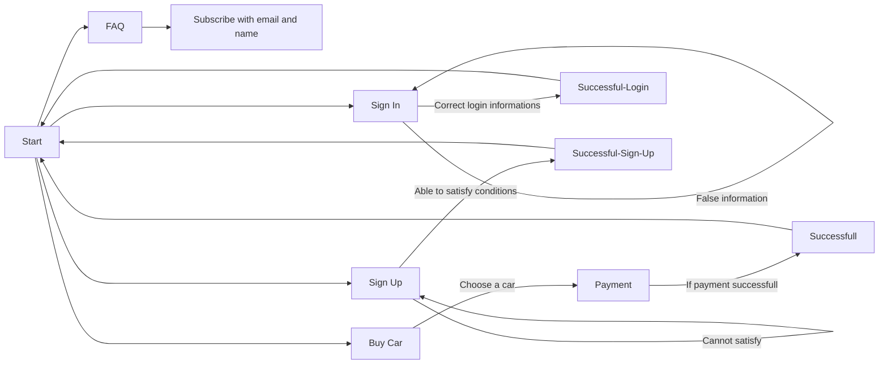

# VeloCar
## Definition
**VeloCar** is a car buying web application. It allows users to view and buy different types of vehicles. The user can also create a membership which makes the usage of the web page easier. The application consists of signing up and signing in, viewing the cars, selecting and visualize selected cars features and buying the cars. It also allows different types of payment methods.

## Usage Scenarios
* Main Page: This is the page where the application starts. At the top of the screen, there are **a brand name** and **signing in**, **signing up**, and **faq** buttons. Additionally, the user can see different types of vehicles at the middle of the screen.

 |Button                         |Purpose					|
|-------------------------------|-----------------------------|
|`Sign In			`|It allow users to sign in to their account.|
|`Sign Up			`|It allow users to sign up to the system.
|`FAQ			        `|It allow users to see frequently asked questions.

*  When the all cars are listed in the screen, they should choose a car to buy. When they selected the car that they want, a screen that shows features of the car appear from the local storage. At that screen, the user can easily switch to the payment screen by clicking **"Buy Now"** button.

* At the payment screen, there are various payment methods that user can buy with. After they made the payment succesfully, the car is theirs!

  

* **Sign In**: If someone created a membership in this application, they can easily sign in to their account with their e-mail address and password. If someone tries to sign in to an account which is not signed up, it gives an error.

* **Sign Up**: Everyone can be a member of the application by clicking this button! It just needs the users name, surname, e-mail address and password. The system creates an account for these informations and stores it. If the informations do not meet the requirements than the account will not be created.

 

* **FAQ**: All questions that are asked before and keep being asked are here. The users can easily click and see all the solutions to the problems they have. An additional feature here is that users can subscribe to the website for additional sales and informations.

## Flow Diagram

## Project Members and Responsibilities

 - **Eren Darak**: Link and transition between main page and car view page, car view page and its functionalities which are provided from database server at port 3001, faq page and its functionalities which holds subscribers in database server at port 3001, markdown document
 - **Ali İlan**: Main page, its functionalities and its layouts and its responsiveness, sign in page and its functionalities which allow users to sign in
 - **Ahmet Berkay Arslanpençe**: Sign up page and its functionalities which holds users in database server at port 3001, payment page and its functionalities which holds database server at port 3001

## Instructions
If you dont have the next on the project simply run this line:
- npm install next -g
By running commands in the project directory with following order will run the project on localhost:3000
- npm install -g json-server
- npx json-server --watch db.json --port 3001
- npm run dev
